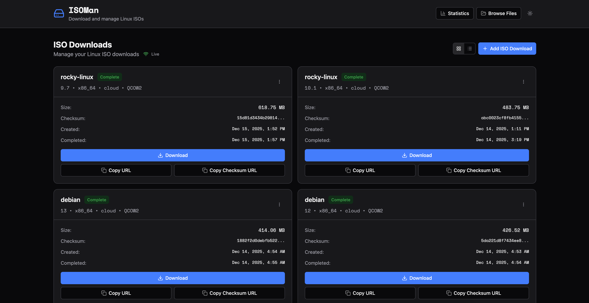
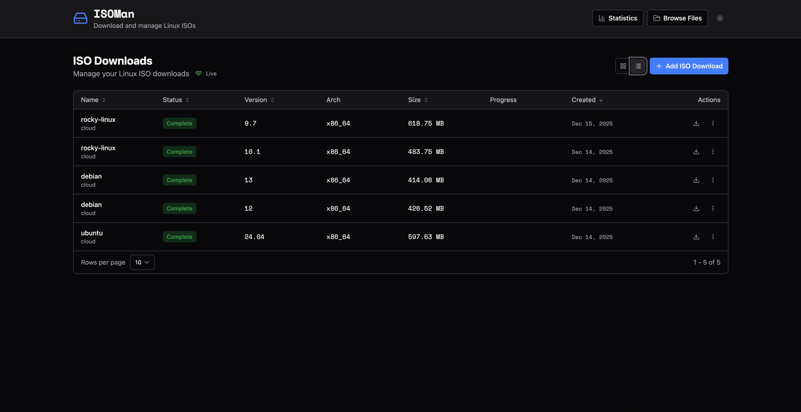
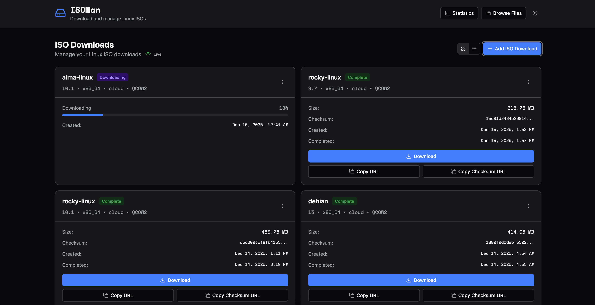
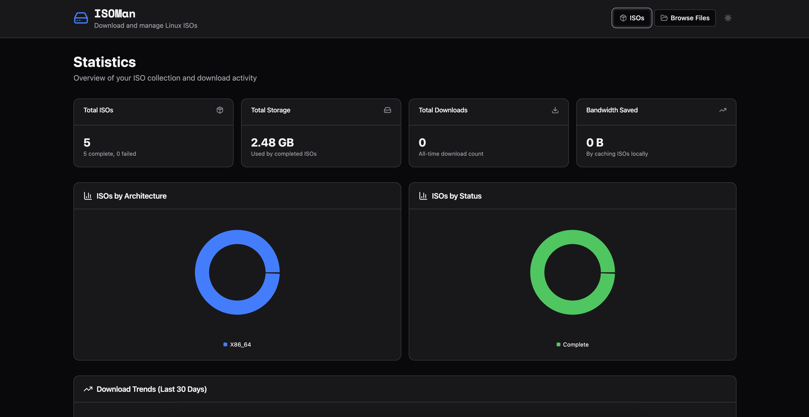
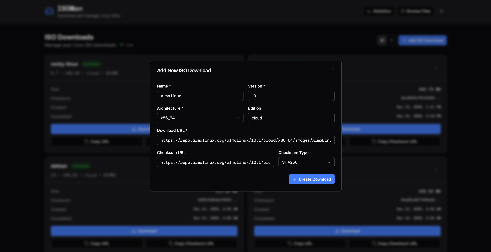
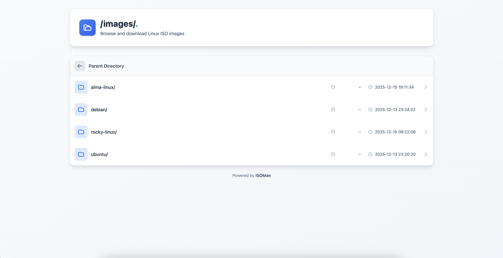

# ISOMan

[](https://github.com/aloks98/isoman/releases/latest)
[](https://github.com/aloks98/isoman/actions/workflows/ci.yml)
[](LICENSE)

A modern, self-hosted Linux ISO download manager with real-time progress tracking and verification.

## Screenshots

<p align="center">
  
  <br><em>Grid view showing completed ISO downloads</em>
</p>

<p align="center">
  
  <br><em>List view with sortable columns</em>
</p>

<p align="center">
  
  <br><em>Real-time download progress tracking</em>
</p>

<p align="center">
  
  <br><em>Statistics dashboard with charts</em>
</p>

<p align="center">
  
  <br><em>Add new ISO download form</em>
</p>

<p align="center">
  
  <br><em>HTTP file browser for direct downloads</em>
</p>

## What is ISOMan?

ISOMan is a web-based application that allows you to download, verify, and serve Linux ISOs (and other disk images) over HTTP. It provides a clean, modern interface to manage your ISO downloads with features like automatic checksum verification, real-time progress updates via WebSocket, and organized file storage.

Perfect for:
- Homelab enthusiasts managing multiple Linux distributions
- System administrators maintaining ISO libraries
- DevOps teams needing centralized ISO storage
- Anyone tired of manually downloading and organizing ISOs

## Features

- **Multiple File Format Support**: Download ISO, QCOW2, VMDK, VDI, IMG, and other disk image formats
- **Organized Storage**: Automatic organization by distribution name, version, and architecture
- **Checksum Verification**: Automatic SHA256/SHA512/MD5 verification during download
- **Real-time Progress**: WebSocket-based live progress updates for all downloads
- **Concurrent Downloads**: Configurable worker pool for parallel downloads
- **Modern UI**: Clean, responsive interface with dark mode support
- **Grid and List Views**: Flexible viewing options with sorting and pagination
- **Apache-style Directory Listing**: Browse and download files directly via HTTP
- **RESTful API**: Full API access for automation and integration
- **Single Container Deployment**: Easy deployment with Docker

## Tech Stack

### Backend
- **Go** - High-performance backend server
- **Gin** - HTTP web framework
- **SQLite** (modernc.org/sqlite) - Pure Go, CGO-free database
- **WebSocket** - Real-time progress updates

### Frontend
- **React** + **TypeScript** - Modern UI framework
- **Vite** + **Rsbuild** - Fast build tooling
- **Tailwind CSS** - Utility-first styling
- **Zustand** - Global state management
- **TanStack Query** - Server state management
- **TanStack Table** - Advanced data grid
- **React Router** - Client-side routing
- **Bun** - Fast JavaScript runtime and package manager

## Quick Start

### Prerequisites

- **Go 1.22+** (for backend development)
- **Bun** (for frontend development)
- **Docker** (for containerized deployment)

### Development Setup

1. **Clone the repository**
   ```bash
   git clone https://github.com/yourusername/isoman.git
   cd isoman
   ```

2. **Start the backend**
   ```bash
   cd backend
   go run main.go
   ```
   Backend will be available at `http://localhost:8080`

3. **Start the frontend** (in a new terminal)
   ```bash
   cd ui
   bun install
   bun run dev
   ```
   Frontend will be available at `http://localhost:3000`

### Docker Deployment

1. **Build the image**
   ```bash
   docker build -t isoman .
   ```

2. **Run the container**
   ```bash
   docker run -d \
     -p 8080:8080 \
     -v isoman-data:/data \
     --name isoman \
     isoman
   ```

3. **Access the application**
   Open `http://localhost:8080` in your browser

## Usage

### Adding an ISO Download

1. Click the "Add ISO" button
2. Fill in the details:
   - **Name**: Distribution name (e.g., "Ubuntu")
   - **Version**: Version number (e.g., "24.04")
   - **Architecture**: CPU architecture (e.g., "x86_64")
   - **Edition** (optional): Variant (e.g., "desktop", "server")
   - **Download URL**: Direct link to the ISO file
   - **Checksum URL** (optional): Link to checksum file for verification
3. Click "Download" to start

### Monitoring Downloads

- Watch real-time progress in the ISO cards
- See download status: pending, downloading, verifying, complete, or failed
- Retry failed downloads with one click

### Accessing ISOs

- **Via UI**: Click "Download" button on completed ISOs
- **Via HTTP**: Navigate to `/images/` for directory listing
- **Direct Link**: Use the copy button to get direct download URLs

## Architecture

```
┌─────────────┐
│   Browser   │
└──────┬──────┘
       │ HTTP/WS
       ▼
┌─────────────────────────────────────┐
│         Gin Web Server              │
│  ┌──────────┐  ┌────────────────┐  │
│  │ REST API │  │ WebSocket Hub  │  │
│  └──────────┘  └────────────────┘  │
└───────────┬─────────────────────────┘
            │
            ▼
┌─────────────────────────────────────┐
│      Download Manager               │
│  ┌──────────────────────────────┐  │
│  │   Worker Pool (concurrent)   │  │
│  │  ┌────────┐    ┌────────┐   │  │
│  │  │Worker 1│    │Worker 2│   │  │
│  │  └────────┘    └────────┘   │  │
│  └──────────────────────────────┘  │
└───────────┬─────────────────────────┘
            │
            ▼
┌─────────────────────────────────────┐
│         SQLite Database             │
│    (Pure Go, no CGO required)       │
└─────────────────────────────────────┘
            │
            ▼
┌─────────────────────────────────────┐
│        File System Storage          │
│   data/isos/{name}/{version}/{arch}/│
└─────────────────────────────────────┘
```

### Storage Structure

```
data/isos/
├── alpine/
│   └── 3.19.1/
│       └── x86_64/
│           ├── alpine-3.19.1-x86_64.iso
│           └── alpine-3.19.1-x86_64.iso.sha256
├── ubuntu/
│   └── 24.04/
│       └── x86_64/
│           ├── ubuntu-24.04-desktop-x86_64.iso
│           └── ubuntu-24.04-server-x86_64.iso
```

## API Reference

See [docs/API.md](docs/API.md) for complete API documentation.

Quick example:

```bash
# Create a download
curl -X POST http://localhost:8080/api/isos \
  -H "Content-Type: application/json" \
  -d '{
    "name": "Alpine Linux",
    "version": "3.19.1",
    "arch": "x86_64",
    "download_url": "https://dl-cdn.alpinelinux.org/alpine/v3.19/releases/x86_64/alpine-standard-3.19.1-x86_64.iso",
    "checksum_url": "https://dl-cdn.alpinelinux.org/alpine/v3.19/releases/x86_64/alpine-standard-3.19.1-x86_64.iso.sha256"
  }'

# List all ISOs
curl http://localhost:8080/api/isos
```

## Documentation

- [API Reference](docs/API.md) - Complete REST API documentation
- [Deployment Guide](docs/DEPLOYMENT.md) - Production deployment instructions
- [CLAUDE.md](CLAUDE.md) - AI assistant context and project structure

## Configuration

### Environment Variables

**Backend:**
- `PORT` - HTTP server port (default: `8080`)
- `DATA_DIR` - Base data directory (default: `./data`)
- `WORKER_COUNT` - Number of concurrent download workers (default: `2`)

**Frontend:**
- `PUBLIC_API_URL` - Backend API URL (default: `http://localhost:8080`)
- `PUBLIC_WS_URL` - WebSocket URL (default: `ws://localhost:8080/ws`)

## Development

### Backend Commands

```bash
cd backend
go run main.go           # Run development server
go build -o server .     # Build production binary
go test ./...            # Run tests
go mod tidy              # Clean up dependencies
```

### Frontend Commands

```bash
cd ui
bun install              # Install dependencies
bun run dev              # Start dev server
bun run build            # Production build
bun run preview          # Preview production build
bun run lint             # Lint code
```

## Contributing

Contributions are welcome! Please feel free to submit a Pull Request.

## License

MIT License - see LICENSE file for details

## Acknowledgments

- Built with [Go](https://golang.org/)
- UI powered by [React](https://react.dev/)
- Icons from [Lucide](https://lucide.dev/)
- Components inspired by [shadcn/ui](https://ui.shadcn.com/)

## Support

For issues, questions, or suggestions, please open an issue on GitHub.
